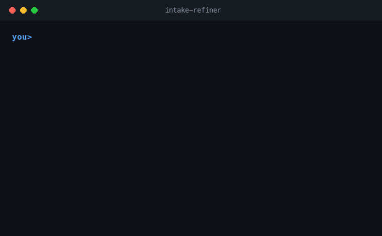

# Agentic Prompt Intake Protocol

A portable protocol that prevents AI agents from executing vague prompts, voice transcripts, loose narration, or poorly framed requests before turning them into a clear, testable, executable task.

The user may speak naturally. The agent must perform intake before acting.

## Context and motivation

This repository started as a practical answer to the conversation sparked by Thiago Finch's viral video about the "mega brain" and speaking to AI naturally: describe the idea out loud, in a stream of thought, and let the agent do the work.

This project complements that idea with a step that is usually missing. Speaking naturally is great for the human, but it is exactly where agents fail most: they tend to execute a loose transcript immediately, as if it were a finished task. Intake bridges natural speech and execution — the agent welcomes the audio / natural language, runs the intake, closes the critical gaps, and only then executes.

In one line: **you speak the way you think; the agent clarifies before it acts.**



> See the full walkthrough in the [demo](docs/DEMO.md).

## One-command install

No need to touch `.claude/`, `.cursor/` or `AGENTS.md` by hand. In your project folder, run:

```bash
npx agentic-prompt-intake
```

The installer **detects your tool** (Claude Code, Codex, GitHub Copilot, Cursor, Cline, Windsurf or Aider), asks whether to install into the **current project** or **globally**, and drops the right files in the right place. It **never overwrites** your `CLAUDE.md`/`AGENTS.md` — it only adds a marked, idempotent block.

Until the npm release is out, you can run it straight from GitHub:

```bash
npx github:vetlucasmartins/agentic-prompt-intake
```

Non-interactive (for scripts/CI):

```bash
npx agentic-prompt-intake --target claude,cursor --scope project --yes
npx agentic-prompt-intake --list      # list all targets
```

## What this repository provides

This repository provides a conversational intake layer for AI agents. It detects when a user input is not execution-ready, organizes intent, identifies critical gaps, asks targeted questions, and produces a refined brief or prompt.

It is designed for multiple tools, not only Claude Code or Codex.

## Core files

- `AGENTS.md`: primary cross-agent contract.
- `.agents/skills/intake-refiner/SKILL.md`: Codex / Agent Skills version.
- `.claude/skills/intake-refiner/SKILL.md`: Claude Code skill version.
- `CLAUDE.md`: Claude Code persistent adapter.
- `.github/copilot-instructions.md`: GitHub Copilot repository instructions.
- `.cursor/rules/intake-refiner.mdc`: Cursor project rule.
- `.clinerules/intake-refiner.md`: Cline workspace rule.
- `.windsurfrules`: Windsurf project rule.
- `prompts/system-intake.md`: system prompt for custom agents or Custom GPTs.
- `schemas/intake-router.schema.json`: structured decision schema.

## Recommended architecture

```text
user input -> intake router -> intake refiner -> main executor
```

Use the router to classify the request as:

- `READY_TO_EXECUTE`
- `NEEDS_LIGHT_REFINEMENT`
- `NEEDS_INTAKE`
- `BLOCKED`

The agent should only execute directly when the request is sufficiently clear or when safe assumptions can be explicitly stated.

## License

MIT.
