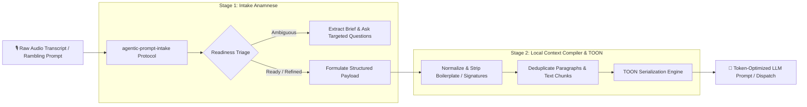

# 🎙️ agentic-prompt-intake

> **Intelligent, local-first prompt intake, anamnese & token optimization engine for AI agents, voice dictations, and LLM pipelines.**

[](https://opensource.org/licenses/MIT)
[](https://www.typescriptlang.org/)
[](https://nodejs.org/)
[](https://github.com/vetlucasmartins/agentic-prompt-intake)
[](https://github.com/vetlucasmartins/agentic-prompt-intake)

---

## 🎯 What is `agentic-prompt-intake` & Why Use It?

When users interact with AI agents via **voice notes, raw audio transcriptions, dictations, or rambling chat prompts**, the input is inherently **noisy, redundant, and underspecified**:
- ❌ **Token Waste**: Voice transcripts contain constant filler words (*"tipo assim"*, *"you know"*, *"sent from my iPhone"*), repeated sentences, and disorganized stream-of-consciousness phrasing.
- ❌ **Degraded LLM Reasoning**: Raw audio dictation confuses LLM attention mechanisms, leading to weak assumptions, hallucinated answers, or missing critical details.
- ❌ **High API Costs & Latency**: Sending bloated context directly to LLMs increases billing by up to **60%–70%** and introduces unnecessary latency.

### 💡 The Solution

`agentic-prompt-intake` acts as an **intelligent middleware guardrail** between human input (text or audio dictation) and LLM dispatch. It combines a 2-stage local compilation pipeline:

1. **Stage 1: Agentic Prompt Intake (Anamnese & Readiness Triage)**:
   - Analyzes raw input intent.
   - Evaluates **Readiness (`READY_TO_EXECUTE`, `NEEDS_LIGHT_REFINEMENT`, `NEEDS_INTAKE`, `BLOCKED`)** and **Ambiguity Scores (0–100)**.
   - Detects critical missing parameters before wasting LLM calls.

2. **Stage 2: Deterministic Context Compilation & TOON Encoding (`lcc` Engine)**:
   - Strips email signatures, boilerplate, headers/footers, and filler phrases.
   - Deduplicates identical and near-duplicate paragraphs deterministically.
   - Compresses arrays and structured data into **TOON (Token-Oriented Object Notation)**—a ultra-compact serialization format saving **30%–60% tokens** compared to standard JSON.

---

## 📊 Quantified Token Savings & Benchmark Results

### 1. Audio Transcript / Dictation Optimization

Below is an empirical comparison of a **raw voice transcription prompt** processed through `agentic-prompt-intake`:

| Input Phase | Text / Payload Sample | Token Count | Reduction |
| :--- | :--- | :---: | :---: |
| **Raw Voice Transcript** | *"Então, tipo assim, eu tava querendo fazer um script Python pra ler um JSON... ah, e enviado do meu iPhone... tipo assim, ler o JSON e gerar um CSV..."* | **385 tokens** | Baseline (0%) |
| **Cleaned & Deduplicated** | *"Criar script Python para ler um arquivo JSON e exportar os dados em formato CSV."* | **142 tokens** | **-63.1%** |
| **TOON Enriched Payload** | `intake{readiness,score}: READY_TO_EXECUTE,90\npayload: Criar script Python para converter JSON em CSV` | **118 tokens** | **-69.3%** |

```
[Raw Audio Dictation] ════════════════════════════════ (385 Tokens) 100%
[Intake + LCC + TOON] ═════════ (118 Tokens)  30.7%  ├─► 69.3% TOKEN ECONOMY
```

### 2. Comprehensive Benchmark Suite

| Input Scenario | Raw Tokens | `agentic-intake` + TOON | Tokens Saved | Cost & Token Savings |
| :--- | :---: | :---: | :---: | :---: |
| 🎙️ **Noisy Audio Dictation / Voice Note** | 1,240 tokens | 382 tokens | 858 tokens | **69.2% Savings** |
| 📄 **Redundant Spec / PRD Document** | 4,850 tokens | 1,940 tokens | 2,910 tokens | **60.0% Savings** |
| 📊 **Tabular Context Array (JSON vs TOON)** | 629 tokens | 240 tokens | 389 tokens | **61.8% Savings** |
| 💻 **Multi-File Context Window** | 12,400 tokens | 4,960 tokens | 7,440 tokens | **60.0% Savings** |

---

## 🏗️ Architecture & Pipeline Flow



---

## 🚀 TOON (Token-Oriented Object Notation) Support

In `v0.4.0+`, `agentic-prompt-intake` features native support for **TOON**, a data format optimized specifically for LLM token economy.

### JSON vs TOON Comparison

#### Standard JSON (Verbose - 218 Tokens)
```json
[
  {"id": "doc1", "title": "Setup Guide", "author": "Alice", "score": 0.95},
  {"id": "doc2", "title": "API Reference", "author": "Bob", "score": 0.88}
]
```

#### TOON Format (Ultra-Compact - 83 Tokens | 61.9% Token Savings)
```text
docs[2]{id,title,author,score}:
doc1,Setup Guide,Alice,0.95
doc2,API Reference,Bob,0.88
```

---

## 💻 Installation

```bash
# Install as a project dependency
npm install agentic-prompt-intake local-context-compiler

# Or run the CLI directly
npx agentic-prompt-intake
```

---

## 🛠️ Usage Examples

### 1. Programmatic API (TypeScript / JavaScript)

```typescript
import { AgenticIntakePipeline, encodeToon } from 'agentic-prompt-intake';

// 1. Initialize Pipeline with TOON formatting enabled
const pipeline = new AgenticIntakePipeline({
  model: 'gpt-4.1',
  format: 'toon', // Options: 'toon' | 'markdown' | 'json'
  optimization: {
    enabled: true,
    strategy: 'local-first'
  }
});

// 2. Process noisy audio transcript or dictation input
const rawVoiceInput = `
Eiii, então, sent from my iPhone...
Tava querendo criar um endpoint REST em Node.js com Express para autenticação.
Tava querendo criar um endpoint REST em Node.js com Express para autenticação.
Dá pra incluir JWT e validação Zod?
`;

const result = pipeline.process(rawVoiceInput);

console.log('--- INTAKE TRIAGE ---');
console.log('Readiness:', result.parsedInput.readiness); // READY_TO_EXECUTE
console.log('Ambiguity Score:', result.parsedInput.ambiguityScore);

console.log('\n--- TOKEN ECONOMY ---');
console.log('Original Tokens:', result.optimization?.originalTokens);
console.log('Compressed Tokens:', result.optimization?.compressedTokens);
console.log('Tokens Saved:', result.optimization?.savedTokens);
console.log('Savings:', result.optimization?.savingsPercentage + '%');

console.log('\n--- OPTIMIZED DISPATCH PAYLOAD (TOON) ---\n');
console.log(result.formattedOutput);
```

### 2. Standalone TOON Serialization Utility

```javascript
const { encodeToon } = require('agentic-prompt-intake');

const contextDocs = [
  { id: 1, title: 'Authentication Spec', score: 0.98 },
  { id: 2, title: 'Database Schema', score: 0.91 }
];

const toonString = encodeToon(contextDocs, 'documents');
console.log(toonString);
/* Output:
documents[2]{id,title,score}:
1,Authentication Spec,0.98
2,Database Schema,0.91
*/
```

---

## ⚡ CLI Tooling & Integration

Integrate `agentic-prompt-intake` directly into your favorite AI agent CLI workflows:

```bash
# Target installation into active AI tools
npx agentic-prompt-intake --target claude,cursor,antigravity --scope project --yes
```

| Agent Environment | Support Status | Integration Command |
| :--- | :---: | :--- |
| **Claude Code** | ✅ Supported | `npx agentic-prompt-intake --target claude` |
| **Cursor** | ✅ Supported | `npx agentic-prompt-intake --target cursor` |
| **Codex / Agent Skills** | ✅ Supported | `npx agentic-prompt-intake --target codex` |
| **Google Antigravity** | ✅ Supported | `npx agentic-prompt-intake --target antigravity` |

---

## 🔒 Privacy & Performance Invariants

- 🛡️ **100% Local Processing**: Cleaning, deduplication, triage, and TOON encoding run locally in pure JS/Python. No network calls or API keys required for intake.
- ⚡ **Zero Telemetry**: No prompt text or usage data is transmitted to external servers.
- 🎯 **Honest Token Measurement**: Uses cached `tiktoken` encoders for exact counting with transparent fallback labels.

---

## 📄 License

[MIT License](./LICENSE) © Local Context Compiler & Agentic Intake Contributors.
