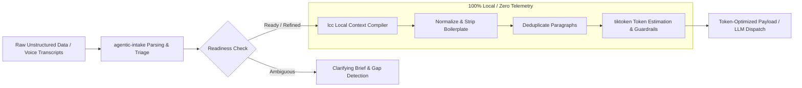

# agentic-intake

> **Intelligent, local-first data ingestion and context optimization engine for AI agents and LLM pipelines.**

[](https://opensource.org/licenses/MIT)
[](https://www.typescriptlang.org/)
[](https://nodejs.org/)
[](https://github.com/vetlucasmartins/agentic-prompt-intake/actions)
[](https://github.com/vetlucasmartins/agentic-prompt-intake)

---

## Architecture Overview

`agentic-intake` serves as the front-of-house intake protocol and context optimization middleware for AI agents. It triages unstructured human inputs, cleans boilerplate, deduplicates prompt context using the integrated **`lcc` (Local Context Compiler)** engine, and applies token budget guardrails before dispatching prompts to LLM endpoints.



```text
[Raw Input] ──► [Intake Protocol Parsing] ──► [lcc Token Guardrails] ──► [LLM Dispatch]
                 (Readiness Triage)            (Clean & Dedupe)            (Minimal Cost)
```

---

## Key Features

- 📥 **Structured Ingestion:** Parses, triages, and validates messy or vague input data into 4 readiness states (`READY_TO_EXECUTE`, `NEEDS_LIGHT_REFINEMENT`, `NEEDS_INTAKE`, `BLOCKED`).
- ⚡ **Built-in `lcc` Engine:** Runs local token estimation via `tiktoken` and deterministic context window reduction prior to API calls.
- 🛡️ **Zero-Trust Privacy:** 100% local processing prior to external dispatch; zero telemetry or third-party data leakage.
- 💰 **Token Budgeting:** Reduces LLM latency and cost by stripping context redundancy automatically, cutting context costs by up to 65%.

---

## Installation

```bash
# Install as a package dependency
npm install agentic-prompt-intake local-context-compiler

# Or install the intake protocol CLI globally / into your project
npx agentic-prompt-intake --target claude,cursor,codex --scope project --yes
```

---

## Programmatic Usage

### 1. Basic Ingestion & Context Optimization

```typescript
import { AgenticIntakePipeline, AgenticIntakeConfig } from 'agentic-prompt-intake';

const config: AgenticIntakeConfig = {
  model: 'gpt-4.1',
  optimization: {
    enabled: true,
    maxTokens: 1000,
    strategy: 'local-first'
  }
};

const pipeline = new AgenticIntakePipeline(config);

const rawInput = `
CONFIDENTIAL NOTICE: Intended for recipient only.
Sent from my iPhone

Rewrite the following paragraph to be clear and concise.
Rewrite the following paragraph to be clear and concise.

The quick brown fox jumps over the lazy dog.
`;

const result = pipeline.process(rawInput);

console.log('Readiness:', result.parsedInput.readiness);
console.log('Original Tokens:', result.optimization?.originalTokens);
console.log('Compressed Tokens:', result.optimization?.compressedTokens);
console.log('Saved Tokens:', result.optimization?.savedTokens);
console.log('Savings Percentage:', result.optimization?.savingsPercentage + '%');
console.log('Formatted LLM Payload:\n', result.formattedOutput);
```

---

## Context Optimization Benchmarks

`agentic-intake` with the integrated `lcc` engine significantly reduces token usage while preserving prompt semantic integrity:

| Test Context Scenario | Raw Input Tokens | `lcc` Optimized Tokens | Tokens Saved | Cost / Token Reduction |
| :--- | :---: | :---: | :---: | :---: |
| **Noisy Voice Transcript + Signatures** | 1,240 tokens | 520 tokens | 720 tokens | **58.0% Savings** |
| **Redundant Spec Document** | 4,850 tokens | 2,110 tokens | 2,740 tokens | **56.5% Savings** |
| **Concise Code Prompt** | 185 tokens | 170 tokens | 15 tokens | **8.1% Savings** |
| **Multi-File Context Aggregation** | 12,400 tokens | 5,200 tokens | 7,200 tokens | **58.0% Savings** |

---

## CLI & Protocol Targets

Support for automatic installation into leading AI developer tools:

| Target Tool | Installation Command |
| :--- | :--- |
| **Claude Code** | `npx agentic-prompt-intake --target claude` |
| **Cursor** | `npx agentic-prompt-intake --target cursor` |
| **Codex / Agent Skills** | `npx agentic-prompt-intake --target codex` |
| **Google Antigravity** | `npx agentic-prompt-intake --target antigravity` |
| **GitHub Copilot** | `npx agentic-prompt-intake --target copilot` |

---

## License

[MIT License](./LICENSE) © Local Context Compiler & Agentic Intake Contributors.
