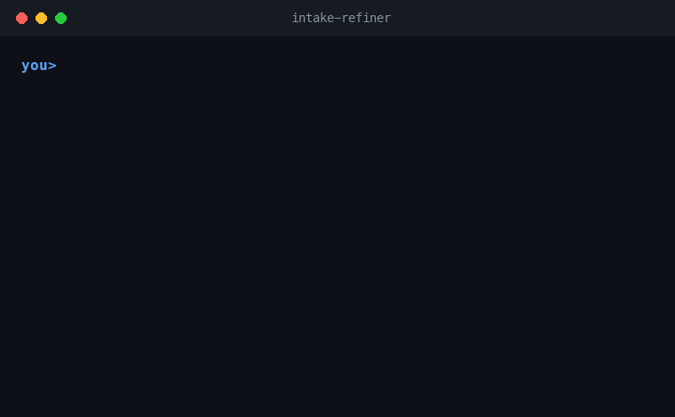

# Agentic Prompt Intake Protocol

A portable intake layer for AI agents. It stops agents from acting on vague
prompts, voice transcripts, rough notes, or half-formed ideas before the request
has been turned into a clear, executable task.

In short: **the user can speak naturally; the agent clarifies before it acts.**



See the walkthrough in [docs/DEMO.md](docs/DEMO.md).

## Why this exists

Modern agents are good at execution, but they often execute too early. A user
may dictate an idea, think out loud, change direction mid-sentence, or ask for
"something better" without specifying the deliverable. Many agents treat that
raw input as if it were a finished spec.

This project adds a small routing layer before execution:

```text
raw user input -> intake router -> intake refiner -> main executor
```

The router decides whether the request is ready, lightly under-specified,
ambiguous, or blocked. The refiner only runs when it is useful. The executor
receives a task brief instead of a guess.

Version `0.4.0` adds activation intelligence: the router now reports objective
activation/suppression signals, readiness and ambiguity scores, and a compact
decision summary so users can see why intake did or did not run without reading
a long brief.

The next `v0.5` phase is about calibration, metrics, and release readiness. It
does not expand the protocol; it checks whether the existing one-pass intake
layer works on real models without becoming expensive.

## What you get

- A cross-agent contract in `AGENTS.md`.
- Agent skills for Codex / Agent Skills and Claude Code.
- Adapters for GitHub Copilot, Cursor, Cline, Windsurf, Zed, Aider, Gemini CLI,
  Google Antigravity, and generic API agents.
- A zero-dependency installer exposed as `agentic-prompt-intake`.
- Router prompts, a JSON schema, reusable templates, examples, and eval cases.
- A validation script and zero-dependency eval runner for checking structure,
  classification, questions, token cost, and over/under-trigger behavior.
- v0.5 quality gates and optional local Markdown eval reports for release
  calibration.

## Install

From a project folder:

```bash
npx agentic-prompt-intake
```

If the npm package is not available in your environment yet, run directly from
GitHub:

```bash
npx github:vetlucasmartins/agentic-prompt-intake
```

For scripts or CI:

```bash
npx agentic-prompt-intake --target claude,cursor --scope project --yes
npx agentic-prompt-intake --list
```

The installer detects supported tools, asks whether to install into the current
project or globally, copies the right skill/rule files, and injects a marked
idempotent block into contract files such as `CLAUDE.md`, `AGENTS.md`, or
`.rules`. It never overwrites those files wholesale.

> Install the protocol in one scope only: project **or** global. Installing in
> both scopes causes the agent to load the intake instructions twice per session,
> wasting tokens without improving behavior.

## Supported tools

| Tool | Installed files | Notes |
|---|---|---|
| Claude Code | `CLAUDE.md`, `.claude/skills/intake-refiner/SKILL.md` | Uses Claude's skill layout plus a persistent adapter. |
| Codex / Agent Skills | `AGENTS.md`, `.agents/skills/intake-refiner/SKILL.md` | Uses the cross-agent contract and the reusable skill. |
| Google Antigravity | `AGENTS.md`, `.agents/skills/intake-refiner/SKILL.md` | Shares the Codex / Agent Skills layout. |
| GitHub Copilot | `.github/copilot-instructions.md`, `.github/instructions/intake-refiner.instructions.md` | Keeps repository instructions concise. |
| Cursor | `.cursor/rules/intake-refiner.mdc` | Adds the intake behavior as a project rule. |
| Cline | `.clinerules/intake-refiner.md` | Adds the intake behavior as a workspace rule. |
| Windsurf | `.windsurfrules` | Adds a short project rule. |
| Zed | `.rules` | Injects the marked block into Zed's default agent rules file. |
| Aider | `CONVENTIONS.md`, `.aider.conf.yml` | Loads the contract and conventions as read-only context. |
| Gemini CLI | `GEMINI.md`, `AGENTS.md` | Points Gemini to the canonical contract. |
| Custom GPT / API agent | `prompts/`, `schemas/`, `templates/` | Use the router schema before the main executor. |

## How agents decide

The protocol uses four labels:

- `READY_TO_EXECUTE`: the request is clear enough to act on now.
- `NEEDS_LIGHT_REFINEMENT`: the request is mostly clear; state assumptions and
  proceed.
- `NEEDS_INTAKE`: essential information is missing; ask focused questions before
  executing.
- `BLOCKED`: the request is unsafe, contradictory, impossible with available
  tools, or lacks a core objective.

Intake is deliberately cheap. Since `v0.3.0`, the rule is:

- one short pass;
- no extended reasoning just to classify a prompt;
- no subagents;
- no file reads or tool calls just to produce a brief;
- 0-3 questions by default, only when the answer changes the output.

Most requests should be `READY_TO_EXECUTE` or `NEEDS_LIGHT_REFINEMENT`. The full
intake brief is reserved for genuinely ambiguous or multi-intent input.

Since `v0.4.0`, the router also weighs activation signals against suppression
signals:

- activation signals: voice-like narration, messy-prompt language, unclear
  deliverable, multiple possible outputs, or missing fields that materially
  change the work;
- suppression signals: a clear action verb, clear deliverable, clear file or
  artifact target, optional-only gaps, standard defaults, or a low-risk first
  step.

Small gaps should not trigger a full intake when the first useful action is
obvious. The router can expose a compact decision card such as:

```text
Decision: NEEDS_LIGHT_REFINEMENT (readiness 72/100, ambiguity 31/100)
Signals: activation: vague_quality_goal; suppression: clear_deliverable
Questions: 0-1
Next: State assumptions and proceed.
```

## Calibration and release readiness

The protocol is only useful if it avoids both premature execution and
unnecessary clarification. The v0.5 calibration workflow measures that directly:

```bash
npm run validate
npm run eval:dry
npm run eval -- --report reports/intake-eval-v0.5.md
```

`npm run eval:dry` is CI-friendly and makes no network calls. `npm run eval`
runs the same cases against a model and requires `INTAKE_EVAL_API_KEY`,
`ANTHROPIC_API_KEY`, or `OPENAI_API_KEY` with the matching provider settings.
Do not put the live eval in CI by default; it depends on credentials and costs
money.

The live summary reports classification accuracy, average output tokens, p95
output tokens, average questions, and over/under-intake candidates. Over-intake
means the model chose a heavier clarification mode than expected, creating
friction and cost. Under-intake means it chose a lighter mode than expected, so
it may execute too early or fail to block unsafe input.

See [docs/QUALITY-GATES.md](docs/QUALITY-GATES.md) for provisional v0.5 release
targets. They are intentionally conservative until multiple real model runs
provide stronger evidence.

## When to trigger intake

Use intake when the user input looks like:

- a voice transcript, rough narration, or thinking aloud;
- a vague request with no clear deliverable;
- a request with several possible outputs;
- an emotionally framed or self-correcting message;
- a project idea missing audience, context, constraints, format, or success
  criteria;
- a request that asks the agent to choose a workflow, platform, or architecture
  without enough context.

Do not run intake when the user already gave a clear task.

Also suppress intake when the only missing details are optional style,
preference, or length choices and a reasonable default would not change the
first output.

## Example

User input:

```text
I sent a messy voice note. I want to create something for parents, maybe a
course, maybe an ebook. Can you organize it?
```

Good intake response:

```markdown
I understand that you want to turn an early product idea for parents into a
clearer direction, but the format and audience are still open.

Structured brief:
- Objective: organize a product/content idea.
- Deliverable: not decided yet; possible course, ebook, or mentoring offer.
- Context: content for parents.
- Audience: parents, but the specific segment is not defined.
- Constraints: not provided.
- Format: to be decided.
- Success criteria: choose a coherent, executable direction.

Critical gaps:
1. The target parent segment is still too broad.
2. The product format has not been chosen.
3. The promised transformation is not explicit.

Questions to unblock:
1. Which parent segment should this help first?
2. What concrete problem should the product solve?
3. Do you want to compare formats first or draft a preliminary offer?
```

## Repository map

```text
.
├── AGENTS.md                                      # Cross-agent contract
├── CLAUDE.md                                      # Claude Code adapter
├── GEMINI.md                                      # Gemini CLI adapter
├── CONVENTIONS.md                                # Aider/general agent conventions
├── bin/cli.js                                    # Zero-dependency installer
├── .agents/skills/intake-refiner/SKILL.md         # Codex / Agent Skills adapter
├── .claude/skills/intake-refiner/SKILL.md         # Claude Code skill
├── .github/copilot-instructions.md                # GitHub Copilot repo instructions
├── .github/instructions/intake-refiner.instructions.md
├── .github/workflows/ci.yml                       # Lightweight local checks
├── .cursor/rules/intake-refiner.mdc               # Cursor rule
├── .clinerules/intake-refiner.md                  # Cline rule
├── .windsurfrules                                 # Windsurf rule
├── .rules                                         # Zed rule
├── docs/INTAKE-PROTOCOL.md                        # Canonical protocol
├── docs/PORTABILITY.md                            # Tool compatibility guide
├── docs/QUALITY-GATES.md                          # v0.5 calibration targets
├── docs/DEMO.md                                   # Demo walkthrough
├── docs/EXAMPLES.md                               # More examples
├── prompts/system-intake.md                       # System prompt for custom agents
├── prompts/intake-router.md                       # Router prompt
├── schemas/intake-router.schema.json              # Router decision schema
├── templates/intake-brief.md                      # Structured brief template
├── templates/execution-prompt.md                  # Final execution prompt template
├── examples/voice-transcript.md                   # Example raw voice-like input
├── examples/vague-prompt.md                       # Example under-specified input
├── evals/intake-cases.jsonl                       # Behavior eval cases
├── scripts/run_eval.mjs                           # Eval runner
├── scripts/eval_report.mjs                        # Eval summary/report helpers
└── scripts/validate_structure.py                  # Structure validator
```

## Use in an API agent

Use the router before the main executor:

```text
user input
  -> prompts/intake-router.md
  -> schemas/intake-router.schema.json
  -> intake refinement when needed
  -> main executor
```

The router returns the v0.4 decision JSON: classification, readiness and
ambiguity scores, activation/suppression signals, recommended mode, compact
summary, known fields, critical gaps, suggested questions, and a provisional
task. Your application can then decide whether to ask the user, state
assumptions, decline safely, or proceed.

## Evaluate behavior

The eval cases in `evals/intake-cases.jsonl` can be checked locally without a
network call:

```bash
npm run eval:dry
```

To run the cases against a model:

```bash
export ANTHROPIC_API_KEY=sk-...           # or INTAKE_EVAL_API_KEY
export INTAKE_EVAL_PROVIDER=anthropic     # default; "openai" is also supported
export INTAKE_EVAL_MODEL=claude-haiku-4-5-20251001
npm run eval -- --report reports/intake-eval-v0.5.md
```

The runner makes one model call per case, with no tools, `temperature 0`, and a
bounded token budget. It scores schema shape, classification, signal
expectations, question budget, required questions, forbidden behaviors, stated
assumptions, and token cost ceilings. The summary reports classification
accuracy, average and p95 output tokens, average questions, and over/under-intake
candidates, plus output-token and question averages by expected class.

The `--report` flag writes the same results to a local Markdown file. It does
not add model calls or change scoring.

## Maintain the protocol

When changing behavior, update files in this order:

1. `docs/INTAKE-PROTOCOL.md`
2. `AGENTS.md`
3. `.agents/skills/intake-refiner/SKILL.md`
4. `.claude/skills/intake-refiner/SKILL.md`
5. Platform adapters only when their behavior changes
6. Examples and eval cases when expected behavior changes

Then run:

```bash
npm run validate
npm run eval:dry
```

## Prior art

The idea of clarifying before execution is not new. The packaging is the point.
Nearby projects include:

- [severity1/claude-code-prompt-improver](https://github.com/severity1/claude-code-prompt-improver),
  which improves prompts through a Claude Code hook.
- [linxaiolu/prompt-clarifier](https://github.com/linxaiolu/prompt-clarifier)
  and [lbexplorer/PromptClarifier](https://github.com/lbexplorer/PromptClarifier),
  which turn vague ideas into structured prompts.
- Prompt refiners such as
  [JacobHuang91/prompt-refiner](https://github.com/JacobHuang91/prompt-refiner),
  which rewrite prompts but do not provide a portable intake contract.

This project combines a cross-agent contract, platform adapters, a decision
router, examples, evals, and a one-command installer.

## Contributing

See [CONTRIBUTING.md](CONTRIBUTING.md). Keep instructions concise, portable, and
consistent across adapters.

## License

MIT. See [LICENSE](LICENSE).
